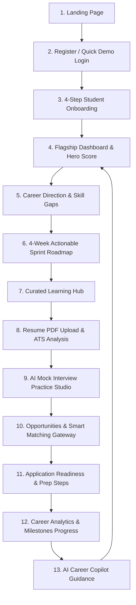

# DishaSetu AI (दिशा-सेतु AI)
> **"Bridging Campus to Career"**  
> *Know Where You Stand. Know What Improves Next. Step Confidently into Your Future.*

Built for the **MP Online Idea & Innovation Hackathon 2026** under Challenge 1: *AI-Powered Career Readiness & Employability Platform*. Aligned with **NEP 2020**, **Skill India Mission**, and **Viksit Bharat 2047**.

---

## 🎯 1. Problem Statement
Every year, hundreds of thousands of engineering and degree students in Madhya Pradesh and across India graduate without knowing their true industry employability. 
- **The Ambiguity Gap**: Students don't know *where they stand* relative to market requirements.
- **Generic Advice**: Advice found online is detached from the student's actual degree, projects, and localized opportunities.
- **Disconnected Tools**: Resume scanners, mock interviews, roadmaps, and job boards exist in isolated silos with zero synthesized readiness feedback.

---

## 💡 2. Solution: DishaSetu AI
DishaSetu AI brings together diagnostic assessment, actionable preparation, and smart opportunity matching into a **single, explainable career intelligence ecosystem**. It continuously answers four critical student questions:
1. **WHERE AM I?** (Deterministic Career Readiness Score & 6-factor diagnostic breakdown)
2. **WHAT IMPROVED?** (Skill coverage, mock interview accuracy, ATS score gains, milestone status)
3. **WHAT IS STILL MISSING?** (Prioritized skill gaps, missing requirements for matching jobs)
4. **WHAT SHOULD I DO NEXT?** (Single, deterministic **Next Best Step** priority recommendation)

---

## 🌟 3. Key Platform Capabilities

| Feature | Description | Engine Type |
| :--- | :--- | :--- |
| **Unified Single Dashboard** | High-impact Career Readiness Gauge, 9-stage Career Journey, and priority Next Best Step. | Deterministic Synthesis |
| **AI Career Intelligence** | Career pathway mapping, industry match %, and structured missing skills taxonomy. | Hybrid (AI + Rule-Based Fallback) |
| **Career Readiness Engine** | Single source of truth weighted score (Technical, Projects, Experience, Academics, Coverage, Interview). | Deterministic Formula |
| **Skill Gap Matrix** | Diagnostic matrix benchmarking student stack against market roles with priority action items. | Deterministic Benchmarking |
| **4-Week Sprint Roadmap** | Dynamic sprint milestone tasks with real-time checkbox progress tracking. | Deterministic Sprint Engine |
| **Curated Learning Hub** | Aligned skill tracks, video/article resources, and certification catalog. | Curated Database |
| **Resume ATS Optimizer** | In-memory PDF upload, ATS score calculation, missing keyword detection, and bullet improver. | In-Memory Parser + ATS Rules |
| **Mock Interview Studio** | Sequential 5-question technical & HR interviews with real-time scoring and performance reports. | AI Evaluation + Rule Fallback |
| **Smart Opportunity Matching** | 4-factor relevance scoring (Skill, Role, Education, Experience) with explainable reasons. | Deterministic Matching (100% Explainable) |
| **Application Readiness** | Diagnostic readiness check before applying (Profile, Skills, ATS Resume, Interview). | Deterministic Evaluation |
| **AI Career Copilot** | Contextual chatbot grounded strictly in the student's authentic verified database facts. | Server-Side AI + Context Injection |
| **Career Analytics** | 8 career milestones, factor breakdowns, and verified weekly activity summaries. | Deterministic Analytics |

---

## 🧭 4. Complete User Flow



---

## 🏗️ 5. Technology Stack

- **Frontend**: React 18, Vite, Tailwind CSS, Framer Motion, Lucide React, React Router 7, Axios, Recharts
- **Backend**: Node.js, Express.js (ES Modules), MongoDB, Mongoose, JWT authentication, Multer, `pdf-parse`, CORS, Dotenv
- **AI/LLM Provider (Server-Side Only)**: Google Gemini API (with deterministic fallback engines)

---

## 📐 6. System Architecture

```
┌─────────────────────────────────────────────────────────────┐
│                    REACT / VITE CLIENT                     │
│  (Modern SaaS Aesthetics, Glassmorphism, Tailwind, Motion)  │
└──────────────────────────────┬──────────────────────────────┘
                               │ HTTP / JSON + JWT Bearer
                               ▼
┌─────────────────────────────────────────────────────────────┐
│                     EXPRESS REST API                        │
│  ├── Unified Auth & Tenant Isolation Middleware             │
│  ├── Deterministic Matching & Analytics Services            │
│  ├── In-Memory Resume Parser & ATS Engine                   │
│  └── Anti-Hallucination Context Injector                    │
└───────────────┬─────────────────────────────┬───────────────┘
                │                             │
                ▼                             ▼
┌───────────────────────────────┐ ┌───────────────────────────┐
│       MONGODB DATABASE        │ │      SERVER-SIDE AI       │
│  • Users & Profiles           │ │  • Gemini 1.5 Pro / Flash │
│  • Roadmaps & Courses         │ │  • Graceful Rule-Based    │
│  • Opportunities (Curated)    │ │    Deterministic Fallback │
│  • Resume & Interview Records │ └───────────────────────────┘
└───────────────────────────────┘
```

---

## 🧠 7. AI Usage vs. Deterministic Architecture

DishaSetu AI adheres to a strict principle of **Explainable Intelligence**:
- **AI is used where generative reasoning adds immense value**:
  1. *Career Assistant*: Synthesizing conversational answers strictly using the student's authentic context.
  2. *Resume Bullet Improver*: Rephrasing experience lines into STAR-method impact statements.
  3. *Mock Interview Scoring*: Analyzing open-ended student answers across accuracy, completeness, and clarity.
- **Deterministic logic is used where trust, consistency, and speed matter**:
  1. *Readiness Score*: 6-factor weighted mathematical formula (0–100).
  2. *Opportunity Match*: 4-factor scoring (Skill 60%, Role 20%, Education 10%, Experience 10%).
  3. *Sprint Progress*: Real-time arithmetic completion ratios.
  4. *Next Best Step*: Deterministic priority tree resolving highest-impact pending actions.

---

## 🚀 8. How to Run Locally

### Prerequisites
- Node.js (v18+)
- MongoDB (running on `mongodb://127.0.0.1:27017`)

### 1. Clone & Configure Server
```bash
cd server
cp .env.example .env
npm install
npm run dev
# Backend running on http://localhost:5000
```

### 2. Configure & Run Client
```bash
cd client
cp .env.example .env
npm install
npm run dev
# Frontend running on http://localhost:5173
```

---

## 🔑 9. Environment Variables

### Server (`server/.env`):
```env
PORT=5000
MONGODB_URI=mongodb://127.0.0.1:27017/dishasetu
JWT_SECRET=dishasetu_super_secret_jwt_key_2026_hackathon
CLIENT_URL=http://localhost:5173
GEMINI_API_KEY=your_gemini_api_key_here
```

### Client (`client/.env`):
```env
VITE_API_URL=http://localhost:5000/api
```

---

## ⏱️ 10. 5–7 Minute Hackathon Demo Walkthrough

Judges and evaluators can experience the full platform journey in 6 simple steps:

1. **Quick Demo Login (10 sec)**:  
   Navigate to `http://localhost:5173/login` and click **“★ Load Hackathon Demo Profile”** (or log in as `demo@dishasetu.ai` / `password123`).
2. **Dashboard & Next Best Step (1 min)**:  
   Inspect the central Career Readiness Gauge (91%), 9-stage career journey, and the highlighted **“★ Your Next Best Step”** priority action.
3. **Skill Gap & 4-Week Roadmap (1.5 min)**:  
   Open `/skills` to review the target skill benchmark matrix, then switch to `/roadmap` and check off an active Sprint Task (observe immediate live progress recalculation).
4. **Resume ATS & Mock Interview (1.5 min)**:  
   Visit `/resume` to review the 84% ATS breakdown and test the 1-click Bullet Improver. Open `/interview` to test a 5-question mock interview session.
5. **Opportunities & Application Readiness (1 min)**:  
   Open `/opportunities` to explore curated MP State & Industry openings. Click any opportunity to see the 4-factor match breakdown and application readiness diagnostic.
6. **Career Analytics & AI Copilot (1 min)**:  
   Navigate to `/analytics` to review 8 verified milestones, then open `/assistant` to ask AI Career Copilot: *"What should I focus on next?"*.

---

## 🏆 11. Hackathon Value & Differentiation
- **Problem**: Millions of Indian college students lack clear guidance on whether they are truly employable.
- **Solution**: DishaSetu AI replaces fragmented guesswork with a unified, transparent career navigation system.
- **Key Differentiator**: Traditional job portals only show job listings; DishaSetu AI actively diagnoses gaps, provides actionable sprints, and prepares students to become hireable.

---
*Developed with ❤️ for MP Online Idea & Innovation Hackathon 2026.*
